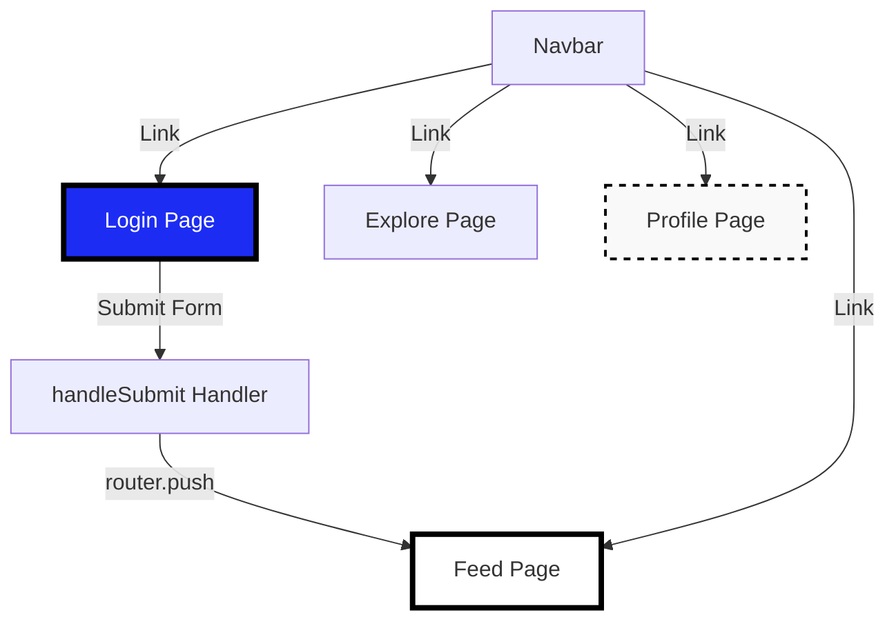
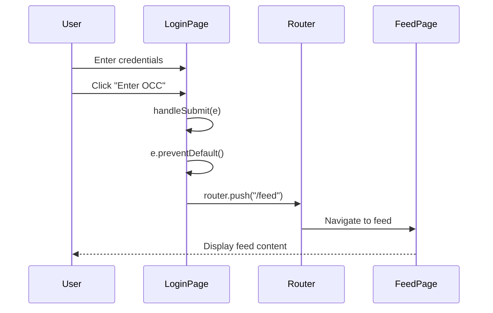

# Design Document: Real Login Flow

## Overview

This refactoring transforms the OCC frontend login experience from a demo authentication flow into a real-looking entry point. The changes are minimal and surgical: remove demo indicators, redirect to the feed page on login, and ensure all navigation targets exist. The design preserves all existing code structure, styling, and functionality while making the login flow feel authentic.

## Architecture



## Main Workflow



## Components and Interfaces

### Component 1: Login Page (app/login/page.tsx)

**Purpose**: Provide authentication UI and redirect users to the feed page upon form submission

**Current State**:
- Contains demo text: "Demo Auth" badge and disclaimer message
- Redirects to "/" (home page) on submit
- Uses Next.js client-side routing

**Target State**:
- Remove demo indicators
- Change button text from "Enter Dashboard" to "Enter OCC"
- Redirect to "/feed" on submit
- Maintain all styling and form functionality

**Interface**:
```typescript
interface LoginPageProps {}

interface LoginFormState {
  email: string;
  password: string;
}

function handleSubmit(e: React.FormEvent): void
```

**Responsibilities**:
- Render login form with email and password fields
- Handle form submission
- Navigate to feed page on successful submission
- Maintain existing styling and UX

### Component 2: Navbar (components/Navbar.tsx)

**Purpose**: Provide global navigation across the application

**Current State**:
- Links to /feed, /explore, /profile, /login
- Responsive design with desktop and mobile views
- All links already functional

**Target State**:
- Add "Off Campus Clubs" text under OCC logo
- Verify all link targets exist

**Interface**:
```typescript
interface NavbarProps {}

// Navigation links
const navLinks = [
  { href: "/feed", label: "Feed", icon: LayoutDashboard },
  { href: "/explore", label: "Explore", icon: Compass },
  { href: "/profile", label: "Profile", icon: UserCircle },
  { href: "/login", label: "Login", icon: LogIn }
]
```

**Responsibilities**:
- Render navigation links
- Display OCC logo with "Off Campus Clubs" subtitle text
- Provide responsive mobile/desktop layouts
- Maintain visual consistency

### Component 3: Profile Page (app/profile/page.tsx)

**Purpose**: Display user profile information (currently missing)

**Current State**: Does not exist

**Target State**: Create minimal placeholder page to satisfy navigation requirements

**Interface**:
```typescript
interface ProfilePageProps {}

export default function ProfilePage(): JSX.Element
```

**Responsibilities**:
- Render basic profile page structure
- Match existing design system (brutal design style)
- Provide placeholder content

## Data Models

### LoginFormData

```typescript
interface LoginFormData {
  email: string;      // User email address
  password: string;   // User password (not validated in this refactor)
}
```

**Validation Rules**:
- email: Required, must be valid email format (HTML5 validation)
- password: Required, any non-empty string

### NavigationLink

```typescript
interface NavigationLink {
  href: string;           // Route path
  label: string;          // Display text
  icon: LucideIcon;       // Icon component
}
```

**Validation Rules**:
- href: Must be valid Next.js route path
- label: Non-empty string
- icon: Valid Lucide React icon component

## Key Functions with Formal Specifications

### Function 1: handleSubmit()

```typescript
function handleSubmit(e: React.FormEvent): void {
  e.preventDefault();
  router.push("/feed");
}
```

**Preconditions:**
- `e` is a valid React form event
- `router` is initialized Next.js router instance
- `/feed` route exists and is accessible

**Postconditions:**
- Form default submission is prevented
- User is navigated to `/feed` page
- No form data is transmitted or validated
- Navigation occurs client-side without page reload

**Loop Invariants:** N/A (no loops)

### Function 2: ProfilePage Component

```typescript
export default function ProfilePage(): JSX.Element {
  return (
    <div className="min-h-screen bg-brutal-gray">
      {/* Profile content */}
    </div>
  );
}
```

**Preconditions:**
- Next.js app router is configured
- Global styles are loaded
- Brutal design system CSS classes are available

**Postconditions:**
- Returns valid JSX element
- Renders full-height page with brutal-gray background
- Matches design system conventions
- Page is accessible via `/profile` route

**Loop Invariants:** N/A (no loops)

## Algorithmic Pseudocode

### Main Login Flow Algorithm

```pascal
ALGORITHM handleLoginSubmission(event)
INPUT: event of type React.FormEvent
OUTPUT: void (side effect: navigation)

BEGIN
  // Precondition: event is valid form submission event
  ASSERT event IS NOT NULL
  ASSERT router IS initialized
  ASSERT route "/feed" EXISTS
  
  // Step 1: Prevent default form submission
  event.preventDefault()
  
  // Step 2: Navigate to feed page
  router.push("/feed")
  
  // Postcondition: User is navigated to feed
  ASSERT currentRoute = "/feed"
END
```

**Preconditions:**
- event is a valid React form event object
- router is an initialized Next.js useRouter instance
- /feed route is defined in the application

**Postconditions:**
- Default form submission behavior is prevented
- Client-side navigation to /feed is initiated
- No page reload occurs
- Browser history is updated

**Loop Invariants:** N/A (no loops in this algorithm)

### Page Existence Verification Algorithm

```pascal
ALGORITHM verifyRequiredPages()
INPUT: none
OUTPUT: boolean (true if all pages exist)

BEGIN
  requiredPages ← ["/feed", "/explore", "/profile", "/login"]
  
  FOR each page IN requiredPages DO
    // Loop invariant: All previously checked pages exist
    ASSERT allPreviouslyCheckedPagesExist(requiredPages[0..currentIndex])
    
    IF NOT pageExists(page) THEN
      RETURN false
    END IF
  END FOR
  
  // Postcondition: All required pages exist
  ASSERT allPagesExist(requiredPages)
  RETURN true
END
```

**Preconditions:**
- Application routing system is configured
- File system access is available for page verification

**Postconditions:**
- Returns true if and only if all required pages exist
- No pages are created or modified
- Verification is read-only operation

**Loop Invariants:**
- All pages checked before current iteration exist
- requiredPages array remains unchanged
- No side effects occur during iteration

## Example Usage

### Example 1: Login Form Submission

```typescript
// User fills out form and clicks submit button
const LoginPage = () => {
  const router = useRouter();
  const [email, setEmail] = useState("");
  const [password, setPassword] = useState("");

  const handleSubmit = (e: React.FormEvent) => {
    e.preventDefault();
    // Navigate to feed page
    router.push("/feed");
  };

  return (
    <form onSubmit={handleSubmit}>
      <input 
        type="email" 
        value={email}
        onChange={(e) => setEmail(e.target.value)}
        required
      />
      <input 
        type="password" 
        value={password}
        onChange={(e) => setPassword(e.target.value)}
        required
      />
      <button type="submit">Enter OCC</button>
    </form>
  );
};
```

### Example 2: Navigation Flow

```typescript
// User navigates through the application
// 1. User visits /login
// 2. User submits login form
// 3. Router navigates to /feed
// 4. User clicks "Profile" in navbar
// 5. Router navigates to /profile

// Navbar component provides all navigation links
<Navbar />
// Links: /feed, /explore, /profile, /login
```

### Example 3: Profile Page Placeholder

```typescript
// Minimal profile page implementation
export default function ProfilePage() {
  return (
    <div className="min-h-screen bg-brutal-gray">
      <div className="max-w-4xl mx-auto p-12">
        <h1 className="text-6xl font-black uppercase tracking-tighter">
          Profile
        </h1>
        <p className="text-xl font-bold mt-4">
          User profile content coming soon.
        </p>
      </div>
    </div>
  );
}
```

## Correctness Properties

### Property 1: Navigation Integrity
**Statement**: ∀ link ∈ NavbarLinks, ∃ page ∈ ApplicationPages such that link.href = page.route

**Verification**: All navbar links must point to existing pages
- /feed → frontend/app/feed/page.tsx ✓
- /explore → frontend/app/explore/page.tsx ✓
- /profile → frontend/app/profile/page.tsx (to be created)
- /login → frontend/app/login/page.tsx ✓

### Property 2: Login Redirect Correctness
**Statement**: ∀ submission ∈ LoginFormSubmissions, submission.preventDefault() ∧ router.push("/feed")

**Verification**: Every login form submission must prevent default behavior and navigate to feed

### Property 3: Demo Text Removal
**Statement**: ∀ element ∈ LoginPageElements, element.content ∉ DemoIndicators

**Verification**: No demo-related text should appear on the login page
- DemoIndicators = {"Demo Auth", "This is a dummy login", "Any credentials will work"}

### Property 4: Styling Preservation
**Statement**: ∀ component ∈ ModifiedComponents, component.styles_before = component.styles_after

**Verification**: All CSS classes and styling must remain unchanged

### Property 5: Code Structure Preservation
**Statement**: ∀ component ∈ ModifiedComponents, component.structure_before ≈ component.structure_after

**Verification**: Component structure, imports, and exports remain unchanged (only content modifications)

## Error Handling

### Error Scenario 1: Missing Profile Page

**Condition**: User clicks profile link but page doesn't exist
**Response**: Next.js 404 error page is displayed
**Recovery**: Create profile page placeholder to prevent 404

### Error Scenario 2: Router Not Initialized

**Condition**: handleSubmit called before router is ready
**Response**: Runtime error or navigation failure
**Recovery**: Ensure useRouter is called at component top level (already correct)

### Error Scenario 3: Invalid Route Path

**Condition**: router.push() called with non-existent route
**Response**: Next.js navigates but shows 404
**Recovery**: Verify all routes exist before deployment

## Testing Strategy

### Unit Testing Approach

**Test 1: Login Form Submission**
- Verify handleSubmit prevents default form behavior
- Verify router.push is called with "/feed"
- Verify no demo text appears in rendered output

**Test 2: Navbar Links**
- Verify all links render correctly
- Verify href attributes point to correct routes
- Verify responsive behavior (desktop/mobile)

**Test 3: Profile Page Rendering**
- Verify page renders without errors
- Verify basic content structure
- Verify styling matches design system

### Property-Based Testing Approach

**Property Test Library**: fast-check (for TypeScript/React)

**Property Test 1: Navigation Link Validity**
```typescript
// Property: All navbar links must point to valid routes
fc.assert(
  fc.property(
    fc.constantFrom("/feed", "/explore", "/profile", "/login"),
    (route) => {
      const pageExists = checkRouteExists(route);
      return pageExists === true;
    }
  )
);
```

**Property Test 2: Form Submission Idempotency**
```typescript
// Property: Multiple form submissions should always navigate to /feed
fc.assert(
  fc.property(
    fc.nat(10), // Submit form 0-10 times
    (submitCount) => {
      for (let i = 0; i < submitCount; i++) {
        handleSubmit(mockEvent);
      }
      return router.currentRoute === "/feed";
    }
  )
);
```

### Integration Testing Approach

**Test 1: End-to-End Login Flow**
- Navigate to /login
- Fill out form fields
- Submit form
- Verify navigation to /feed
- Verify feed page renders correctly

**Test 2: Navigation Flow**
- Start at /login
- Navigate through all navbar links
- Verify each page loads without errors
- Verify no 404 errors occur

## Performance Considerations

- Client-side navigation using Next.js router (no page reloads)
- Minimal JavaScript changes (only text removal and route change)
- No new dependencies or imports required
- Profile page is lightweight placeholder (minimal rendering cost)

## Security Considerations

- No actual authentication logic is implemented (out of scope)
- Form data is not transmitted or stored
- No security changes from current implementation
- Demo nature of login is preserved (just visually hidden)

## Dependencies

**Existing Dependencies** (no new dependencies required):
- next: ^14.x (Next.js framework)
- react: ^18.x (React library)
- lucide-react: ^0.x (Icon library)
- TypeScript: ^5.x (Type system)

**No new dependencies are required for this refactoring.**
